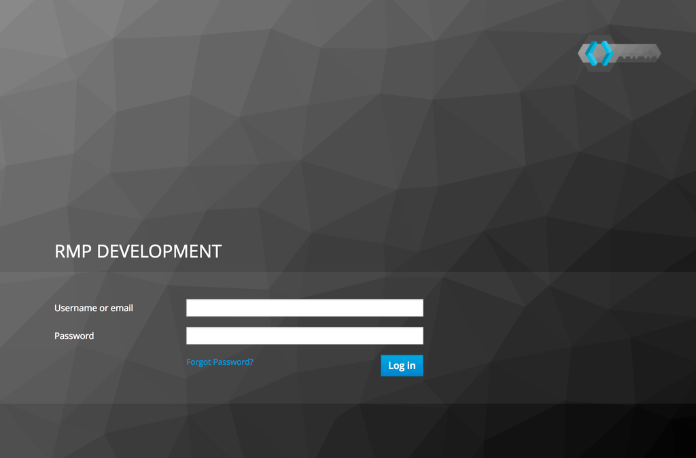
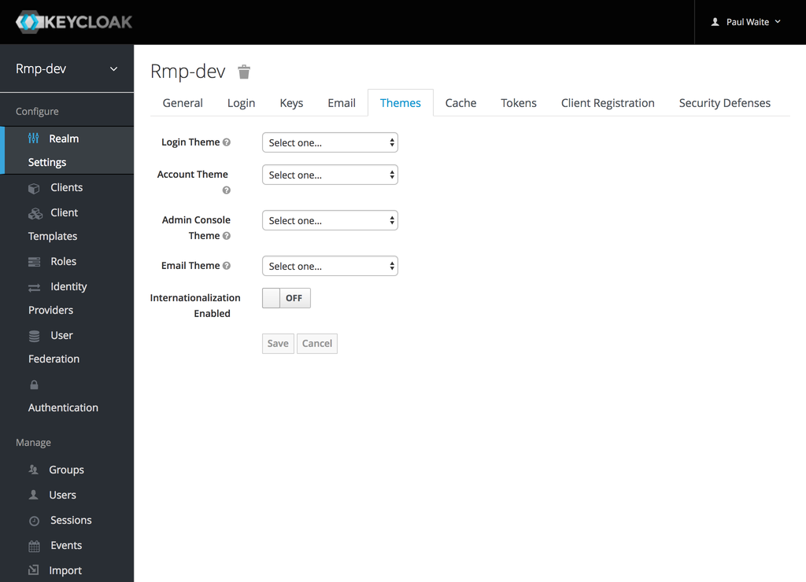
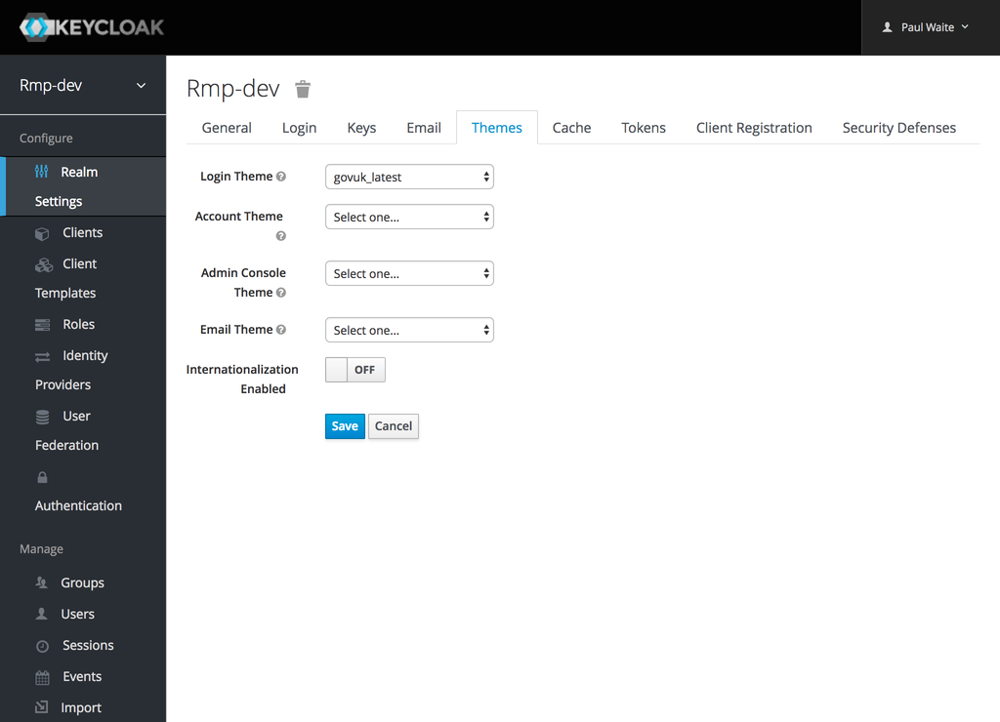
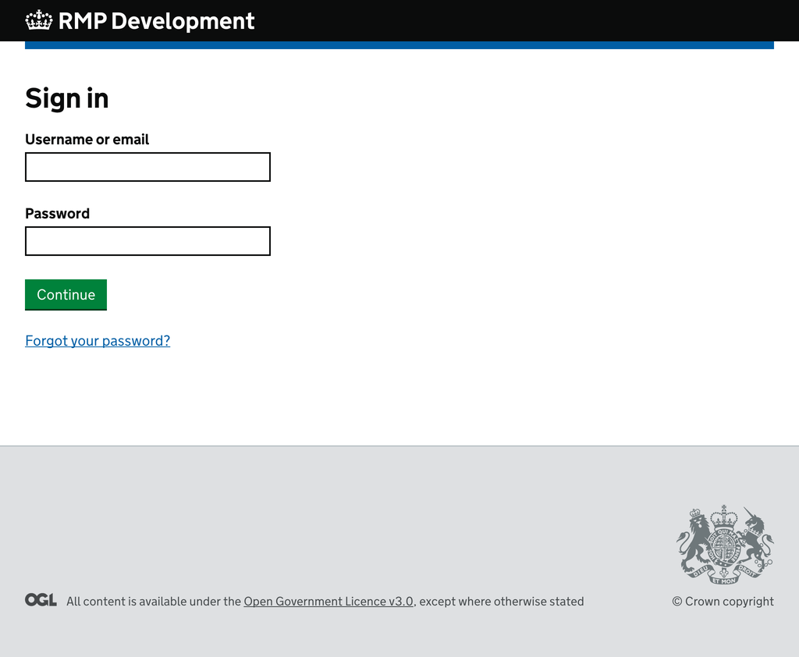
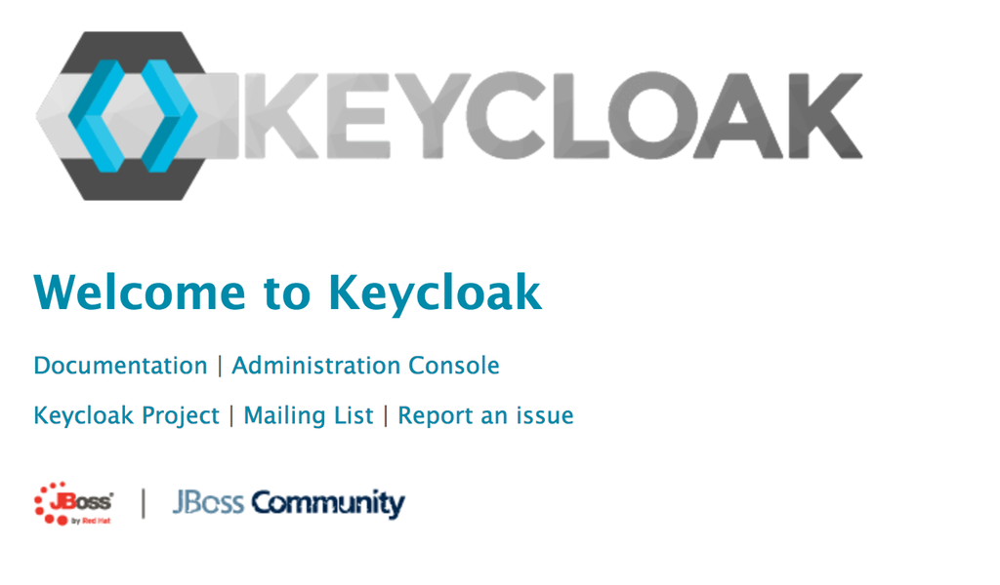

# keycloak-theme
A Keycloak theme customization.

- [Using](#using)
- [Developing](#developing)
    - [Building](#building)
    - [Local Keycloak server](#local-keycloak-server)
- [Releasing](#releasing)

## Using
To use it in your Keycloak realm:

1. Sign into your realm's admin console.

    

2. Go to the “Themes” tab in “Realm Settings”

    

3. Select “govuk” as your login theme, and click on “Save”

    

The theme will now be used for all Keycloak log in screens on your realm - including logging in to the admin console. If you sign out, you should see the GOV.UK themed log in screen.




## Developing

### Local Keycloak server
A local Keycloak server for developing and testing the theme is available as a Docker container.

To bring up the server, make sure you’ve installed and started [Docker Community Edition](https://docs.docker.com/engine/installation/), then use the following commands:
```bash
$ docker-compose up
```
The Keycloak server will now be available on <http://localhost:9080>. You can log into the Administration Console using “**admin**” as both username and password.



## Releasing
The theme can be packaged in a new image using the following command:
```bash
$ docker build -t rodrigodmd/keycloak:<version> .
$ docker push rodrigodmd/keycloak:<version>
```

You can also run it:
```bash
$ docker run -it rodrigodmd/keycloak:<version>
```

